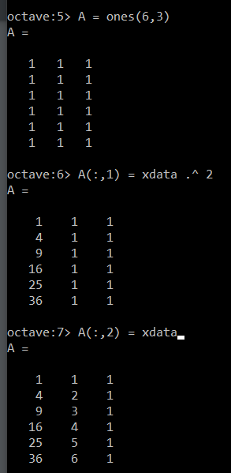
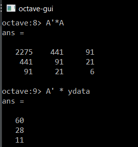

---
# Front matter
lang: ru-RU
title: "Отчёт по лабораторной работе №5"
subtitle: "Работа с линейным пространством"
author: "Юрченко Сергей Валерьевич"

# Formatting
toc-title: "Содержание"
toc: true # Table of contents
toc_depth: 2
lof: true # List of figures
lot: true # List of tables
fontsize: 12pt
linestretch: 1.5
papersize: a4paper
documentclass: scrreprt
polyglossia-lang: russian
polyglossia-otherlangs: english
mainfont: PT Serif
romanfont: PT Serif
sansfont: PT Sans
monofont: PT Mono
mainfontoptions: Ligatures=TeX
romanfontoptions: Ligatures=TeX
sansfontoptions: Ligatures=TeX,Scale=MatchLowercase
monofontoptions: Scale=MatchLowercase
indent: true
pdf-engine: lualatex
header-includes:
  - \linepenalty=10 # the penalty added to the badness of each line within a paragraph (no associated penalty node) Increasing the value makes tex try to have fewer lines in the paragraph.
  - \interlinepenalty=0 # value of the penalty (node) added after each line of a paragraph.
  - \hyphenpenalty=50 # the penalty for line breaking at an automatically inserted hyphen
  - \exhyphenpenalty=50 # the penalty for line breaking at an explicit hyphen
  - \binoppenalty=700 # the penalty for breaking a line at a binary operator
  - \relpenalty=500 # the penalty for breaking a line at a relation
  - \clubpenalty=150 # extra penalty for breaking after first line of a paragraph
  - \widowpenalty=150 # extra penalty for breaking before last line of a paragraph
  - \displaywidowpenalty=50 # extra penalty for breaking before last line before a display math
  - \brokenpenalty=100 # extra penalty for page breaking after a hyphenated line
  - \predisplaypenalty=10000 # penalty for breaking before a display
  - \postdisplaypenalty=0 # penalty for breaking after a display
  - \floatingpenalty = 20000 # penalty for splitting an insertion (can only be split footnote in standard LaTeX)
  - \raggedbottom # or \flushbottom
  - \usepackage{float} # keep figures where there are in the text
  - \floatplacement{figure}{H} # keep figures where there are in the text
---

# Цель работы

 Научится на практике работать с подгонкой полиномиальной кривой методом меньших квадратов, а так же с матричными преобразованиями

# Задание

• Сделать отчёт по лабораторной работе в формате Markdown.
• В качестве ответа предоставить отчёты в 3 форматах: pdf, docx и md (в архиве, поскольку он должен содержать скриншоты, Makefile и т.д.)

# Выполнение лабораторной работы

## Подгонка полиномиальной кривой

1. Для того чтобы найти параболу по методу наименьших квадратов для набора точек, заданных матрицей `D`, вектор `x` - в матрице это первый столбец, вектор `y` - второй столбец, первым шагом построил матрицу и извлёк векторы (рис. -@fig:001).

{ #fig:001 width=70% }

2. Строим точки на графике (рис. -@fig:002).

{ #fig:002 width=70% }

3. Работаю с матричным квадратным уравнением и строю матрицу системы, содержащей значения `x`, подставленные в квадратное уравнение как $x^2$, $x^1$ и $x^0$ при коэффицентах `a`, `b` и `c`. Матрица системы называется `A`.
Создадим матрицу единиц в 6 строк и 3 столбца функцией `ones()` и  подставилим нужные значения в первый и второй столбец (рис. -@fig:003).

{ #fig:003 width=70% }

4. Решение  получается из уравнения, где в левой части действие на строке 8, а справа действие  строке 9 (рис. -@fig:004). Домножаем  на транспонированную матрицу системы `A`. Здесь мы просто смотрим на результат действий.

{ #fig:004 width=70% }

5. Создаем дополненную матрицу `B`, записывая туда результаты  , применяем метод Гаусса через функцию `rref()`, для нахождения окончательного решения. Полученную матрицу с решением записываем в новую матрицу `B_res`, а уже из её четвёртого столбца с решениями, берем  3 значения в отдельные переменные `a1`, `a2`, `a3` (они отвечают за коэффиценты `a`,`b`,`c`) (рис. -@fig:005).

{ #fig:005 width=70% }

6. Строим соответствующий график для демонстрации подгонки значений  (рис. -@fig:006).

{ #fig:006 width=70% }

7. Теперь поработаем со встроенными функциями для подгонки: `polyfit()` и функцию `polyval()` для получения значения полинома P в точках, задаваемых вектором-строкой `x` (рис. -@fig:007).

{ #fig:007 width=70% }

8. Строим график, аналогичный предыдущему (рис. -@fig:008).

{ #fig:008 width=70% }

## Матричные преобразования

9. Зададим матрицу `D` для работы с изображением домика в которую запишим все вершины изображения.  Домик представляет из себя конечный граф. Из матрицы вынул значения `x`,`y` и изобразил граф (рис. -@fig:009).

{ #fig:009 width=70% }

10.   Для вращения объекта, заданного матрицей, нужно домножить исходную на матрицу вращения.Переводим нужный  угол в радианы, подставляем в матрицу вращения и домножаем слева на исходную матрицу. Сначала поворачиваю матрицу на 90 градусов (рис. -@fig:010).

{ #fig:010 width=70% }

11.  Из первой и второй строчки выделяем значения `x`, `y` и записываем в переменные `x1`, `y1` (рис. -@fig:011).

{ #fig:011 width=70% }

1.  Повторим шаги 10, 11 для поворота на 225 градусов. Значения `x`, `y` записываем в переменные `x2`, `y2` (рис. -@fig:012).

{ #fig:012 width=70% }

13. Изображаем все домики в трёх цветах (рис. -@fig:013).

{ #fig:013 width=70% }

14.   Так же можно задать отражение относительно некоторой прямой для того чтобы повернуть изображение. В методичке  задана матрица отражения `R` исходя из отражения видно, что прямая идёт под углом 45 градусов, следовательно в функию $\sin(2\theta)$ из побочной диагонали матрицы отражения было подставлено значение $\rfrac{\pi}{4}$.  проведем домножение исходной матрицы на матрицу отражения и построим диаграмму (рис. -@fig:014).

{ #fig:014 width=70% }

1.   Дилатация: увеличим домик в 2 раза с помощью домножения на матрицу `T`, состоящую из двух базисных векторов. А далее выводим результат на экран в виде диаграммы (рис. -@fig:015).

{ #fig:015 width=70% }

# Выводы
На практике освоил методы матричных преобразований и подгонку значений методом меньших квадратов в языке Octave.