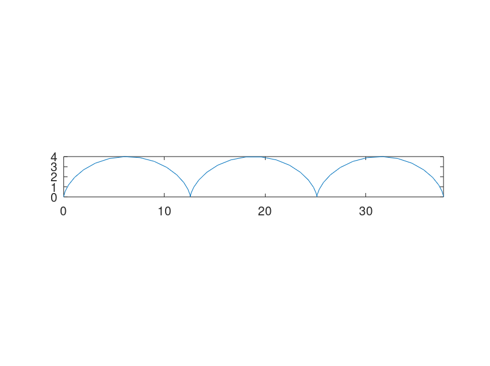
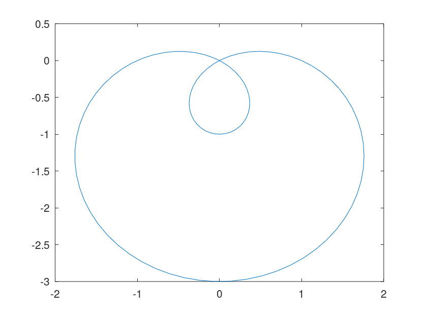
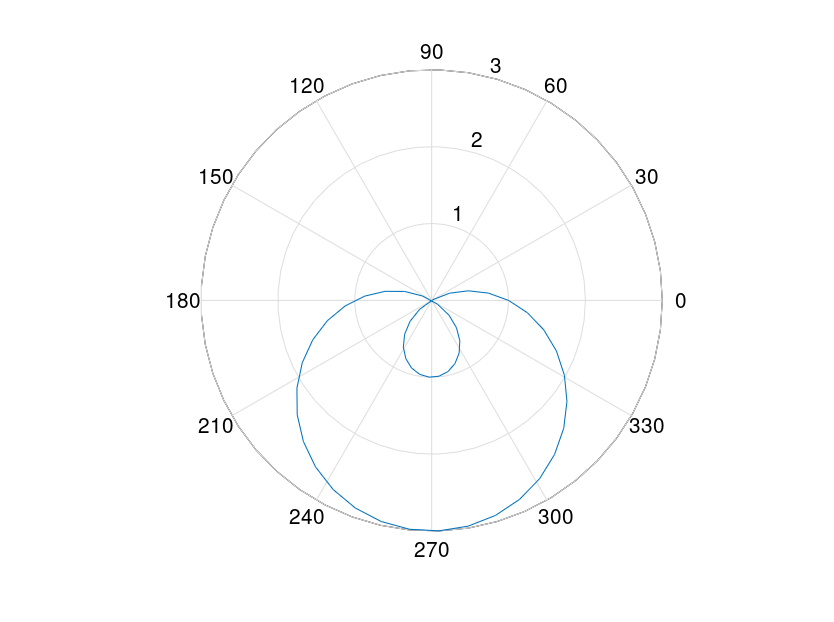
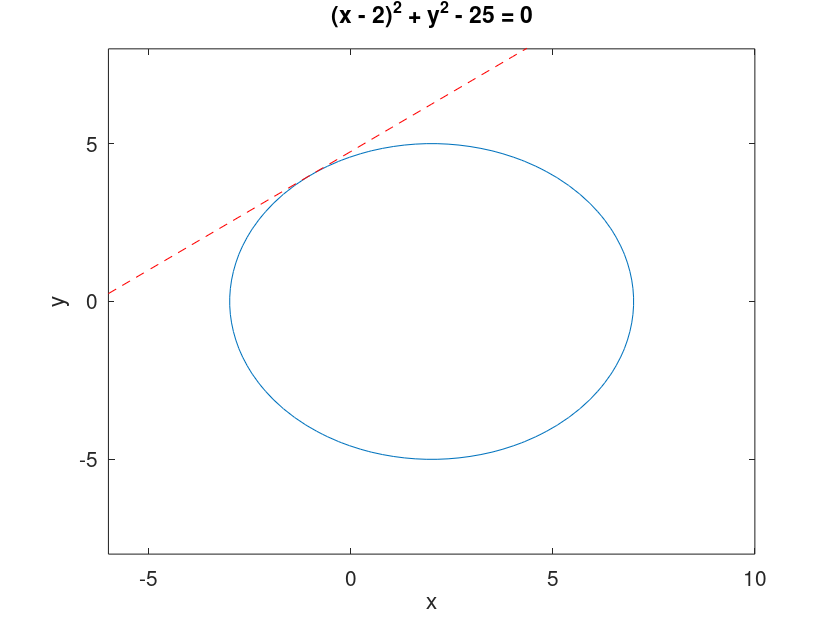
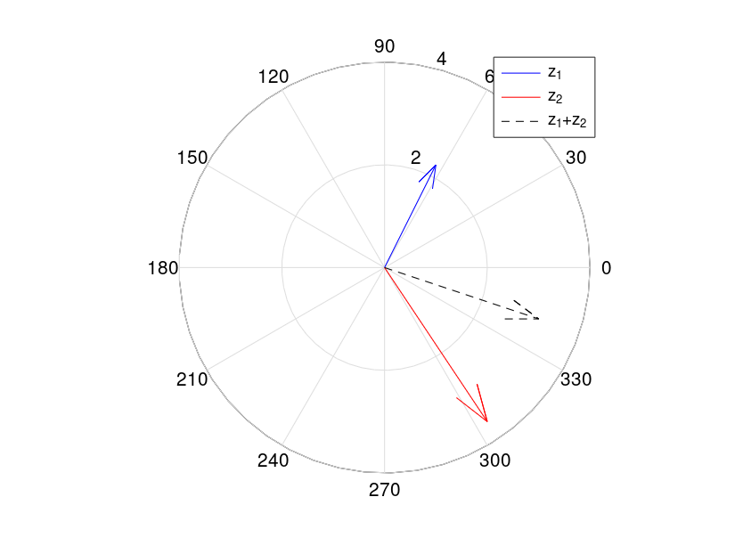
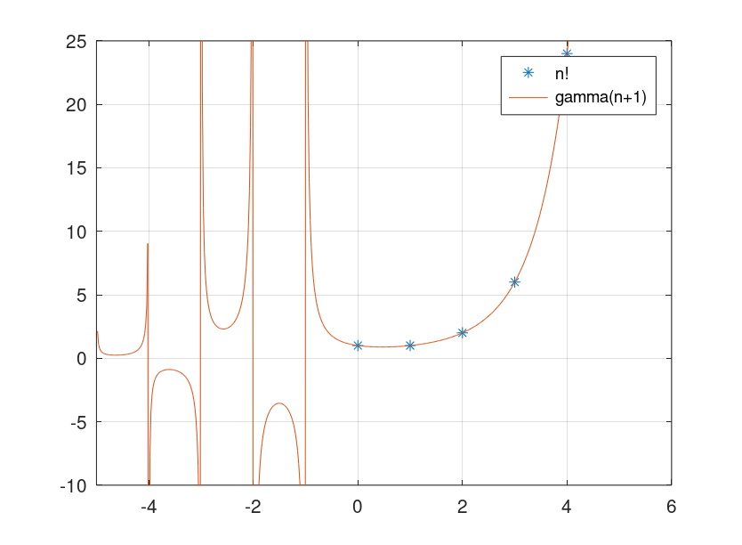
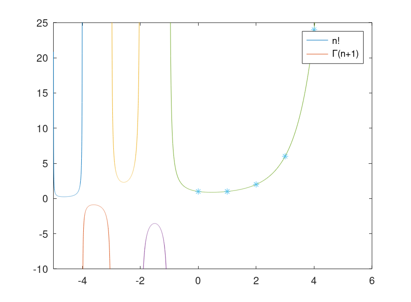

---
# Front matter
lang: ru-RU
title: "Лабораторная работа №7"
#subtitle: ""
author: "Юрченко Сергей группа НФИбд-03-19"

# Formatting
toc-title: "Содержание"
toc: true # Table of contents
toc_depth: 2
lof: true # List of figures
# lot: true # List of tables
fontsize: 12pt
linestretch: 1.5
papersize: a4paper
documentclass: scrreprt
polyglossia-lang: russian
polyglossia-otherlangs: english
mainfont: PT Serif
romanfont: PT Serif
sansfont: PT Sans
monofont: PT Mono
mainfontoptions: Ligatures=TeX
romanfontoptions: Ligatures=TeX
sansfontoptions: Ligatures=TeX,Scale=MatchLowercase
monofontoptions: Scale=MatchLowercase
indent: true
pdf-engine: lualatex
header-includes:
  - \linepenalty=10 # the penalty added to the badness of each line within a paragraph (no associated penalty node) Increasing the value makes tex try to have fewer lines in the paragraph.
  - \interlinepenalty=0 # value of the penalty (node) added after each line of a paragraph.
  - \hyphenpenalty=50 # the penalty for line breaking at an automatically inserted hyphen
  - \exhyphenpenalty=50 # the penalty for line breaking at an explicit hyphen
  - \binoppenalty=700 # the penalty for breaking a line at a binary operator
  - \relpenalty=500 # the penalty for breaking a line at a relation
  - \clubpenalty=150 # extra penalty for breaking after first line of a paragraph
  - \widowpenalty=150 # extra penalty for breaking before last line of a paragraph
  - \displaywidowpenalty=50 # extra penalty for breaking before last line before a display math
  - \brokenpenalty=100 # extra penalty for page breaking after a hyphenated line
  - \predisplaypenalty=10000 # penalty for breaking before a display
  - \postdisplaypenalty=0 # penalty for breaking after a display
  - \floatingpenalty = 20000 # penalty for splitting an insertion (can only be split footnote in standard LaTeX)
  - \raggedbottom # or \flushbottom
  - \usepackage{float} # keep figures where there are in the text
  - \floatplacement{figure}{H} # keep figures where there are in the text
---

# Цель работы

  Научится работать с графиками и функциями, провести операции с комплексными числами

# Задание работы

Выполнить лабораторную работу и сделать отчет по лабораторной работе в форматах md, docx и pdf.

# Выполнение лабораторной работы

1. Создаем каталог lab07 для работы. (mkdir) (@fig:001)

{ #fig:001 width=80% }

## Параметрические графики
1. Переходим в рабочую папку в octave,проверяем при помощи (pwd). (@fig:002)

{ #fig:002 width=40% }

1. Задаем параметр $t$ и радиус $r$ для дальнейшего вычисления $x$,$y$ (@fig:003)

{ #fig:003 width=60% }

3. Вычисляем с помощью заданных параметров $x$ и $y$. (@fig:004)   
   
 { #fig:004 width=60% }

4. Постороим график параметрической функции {#fig:005} {#fig:006}   

{ #fig:005 width=60% }
{ #fig:006 width=40% }

5. С помощью axis задаем равнозначные асимптоты {#fig:007}{#fig:008}

 { #fig:007 width=40% }
 { #fig:008 width=40% }

6. Задаем асимптоты по размеру графика {#fig:009}{#fig:010}

{ #fig:009 width=40% }
{ #fig:010 width=40% }

## Полярные Координаты 

1. Графики в полярных координатах строятся аналогичным образом, Задаем параметр $T$, $r$ - радиус.
Так же задаем $x$,$y$ {#fig:011}

{ #fig:011 width=40% }

2. С помощью **plot** выводим график. {#fig:012}{#fig:013}
     
{ #fig:012 width=40% }

{ #fig:013 width=40% }

3. Снова зададим параметры для функции в полярных координатах, но при построении воспользуемся командой **polar**. {#fig:014}{#fig:015}  
     
{ #fig:014 width=40% }

{ #fig:015 width=40% }

## Графики неявых функций 

1.  Зададим уравнение $-x^2-xy+x+y^2-y=1$ в **Octave** {#fig:016}

=1.png){ #fig:016 width=40% }

2. Построим данную кривую на графике при помощи команды **ezplot**.{#fig:017}{#fig:018}

{ #fig:017 width=40% }

{ #fig:018 width=40% }

3. Дана окружность: $(x-2)^2+y^2=25$ 
   
   Задаем окружность и строим её с помощью **ezplot** {#fig:019}{#fig:020}

{ #fig:019 width=40% }

{ #fig:020 width=40% }

4. Задаем косательную и так же стоим её на графике. Для этого задаем параметры $x$ и $y$, и с использованием **hold** достраиваем график.
  {#fig:021}{#fig:022}
   

{ #fig:021 width=40% }

{ #fig:022 width=40% }
   
## Комплексные числа

1. Для проведения простейших математических операций зададим 2 комплексные переменные. И произведем операции над ними.{#fig:023} 

{ #fig:023 width=40% }

2. Теперь при помощи команды **compass** построим эти комплексные числа на графике. Так же укажем легенду на графике.{#fig:024} {#fig:025}
   
{ #fig:024 width=40% }   

{ #fig:025 width=40% } 

## Специальные функции 

1. В **Octave** много специальных функций, однако мы произведем построение гамма-функции. $\\Г(x+1)$ $\\$ И построим график $n!\\$ Для начала зададим значение аргументов $x$ и $n$.{#fig:026}

{ #fig:026 width=40% } 

2. Теперь построим график с помощью команды **plot** {#fig:027}{#fig:028}

{ #fig:027 width=40% }

{ #fig:028 width=40% }

3. Но так как вдоль вертикали в отрицательной области мы имеем артефакты, произведем разделение области значений на отдельные интервалы. {#fig:029}
   
{ #fig:029 width=40% }

4. Теперь произведем построение на основе полученных интервалов.{#fig:030}{#fig:031}

{ #fig:030 width=40% }

{ #fig:031 width=40% }

# Вывод

В ходе выполнения работы произвели построения различных графиков, узнали особенности комплексных чисел и поработали со специальными функциями
